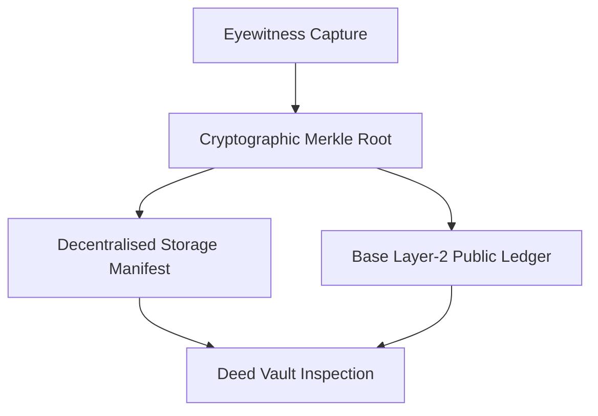

A Digital Deed is an immutable certificate of ownership and commercial licensing issued for every verified scoop on Extra Scoop. It establishes an unbroken, cryptographically verifiable chain of custody between the eyewitness who recorded the event and the newsroom purchasing broadcast rights.



## Structure of a Digital Deed

Each Digital Deed consolidates critical provenance metadata into a standardised legal instrument:

* **Forensic Anchor:** A SHA-256 cryptographic hash combining the unique scoop identifier, the C2PA root manifest, and the purchasing organisation identifier.
* **Licence Terms:** Specifies whether rights are granted on an exclusive or syndication basis, alongside territorial and duration parameters.
* **Chain of Custody:** Records the pseudonymous or verified creator identity, the purchasing newsroom bureau, and the transaction timestamp.
* **Decentralised Manifest:** A complete metadata record pinned to decentralised storage (IPFS), guaranteeing that licensing terms cannot be retroactively altered.
* **On-Chain Settlement Receipt:** A public layer-2 transaction hash anchored to Base, providing mathematical proof of settlement.

## On-Chain Notarization

When an offer is accepted in the dealroom, the settlement engine anchors the deed to the Base layer-2 network:

```solidity
event DeedAnchored(
    bytes32 indexed merkleRoot,
    string indexed scoopId,
    address indexed journalist,
    address agency,
    uint256 pricePaid,
    uint256 timestamp
);
```

This on-chain record allows legal and compliance teams to independently verify media acquisition details on the public blockchain without relying on centralized intermediaries.

## The Deed Vault

Both eyewitnesses and newsrooms manage their deeds through the **Deed Vault**:
* **Eyewitnesses:** View all issued deeds, monitor active commercial offers, verify royalty distributions, and download formal licensing certificates.
* **Newsrooms:** Access purchased high-resolution source files, retrieve C2PA provenance manifests, and export verified editorial packages directly to broadcast CMS systems.

For procedural guidance on buying and managing deeds, see the [Concord Dealroom Guide](/terminal/concord-dealroom).
