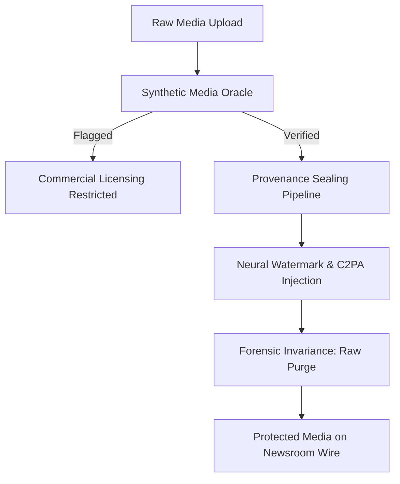

Silicon Trust™ is the core integrity architecture of Extra Scoop. It provides end-to-end verification for breaking news footage by combining hardware-backed capture, automated synthetic-media analysis, and persistent provenance watermarking.

## The Verification Pipeline

When you submit media to the platform, Silicon Trust™ executes a multi-stage inspection process:

### 1. Synthetic Media and Deepfake Detection
Every upload is routed through an independent detection oracle network to evaluate authenticity. The oracle inspects the media for generative artefacts, deepfake manipulation, and synthetic voice synthesis. 

If content fails the synthetic-media check, it is automatically flagged and prevented from entering the commercial licensing pool. The creator receives an immediate in-app notice with the audit result.

### 2. Forensic Provenance Sealing
Once verified, media passes into the provenance sealing pipeline:
* **Neural Watermarking:** An invisible, imperceptible watermark is embedded across the luminance channels of the asset. The watermark encodes the unique scoop identifier and creator signature.
* **Forward Error Correction:** The watermark incorporates forward error correction algorithms, ensuring the provenance signature survives social media compression, screen recording, and broadcast re-encoding.
* **C2PA Manifest Injection:** A cryptographically signed Coalition for Content Provenance and Authenticity (C2PA) manifest is injected into the container, certifying camera parameters and capture timestamps.

### 3. Forensic Invariance (Raw File Purge)
To prevent unwatermarked source material from leaking or being scraped without authorization, the platform enforces **Forensic Invariance**:

1. The sealing service verifies that the protected, watermarked asset exists and is intact.
2. The protected asset replaces the raw asset on the distribution wire.
3. The platform permanently purges the unwatermarked source file from primary storage.

Once purged, only the sealed version with embedded provenance is accessible for preview across the mobile app and newsroom terminal.

## Provenance Guarantees

| Property | Protection Mechanism | Operational Guarantee |
| :--- | :--- | :--- |
| **Authenticity** | Multi-factor oracle screening | Flags AI-generated or manipulated footage before licensing. |
| **Tamper Resistance** | Error-corrected watermarking | Preserves attribution through video re-compression and cropping. |
| **Chain of Custody** | C2PA signed metadata | Verifies hardware origin and capture timestamp for broadcast legal teams. |
| **Source Safety** | Permanent raw purge | Eliminates unauthorized distribution of unprotected raw media. |
