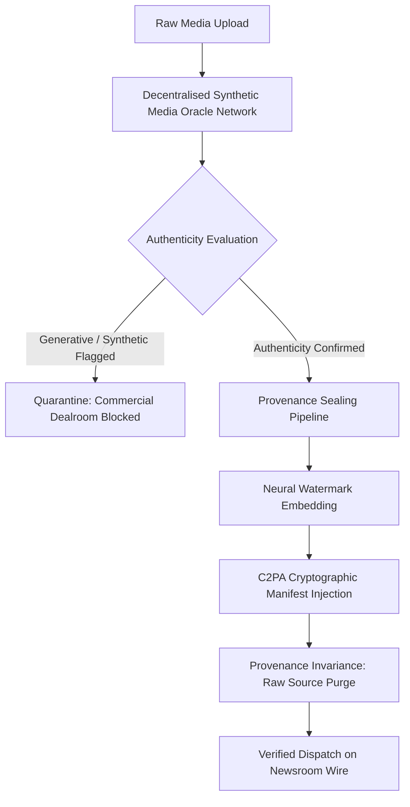
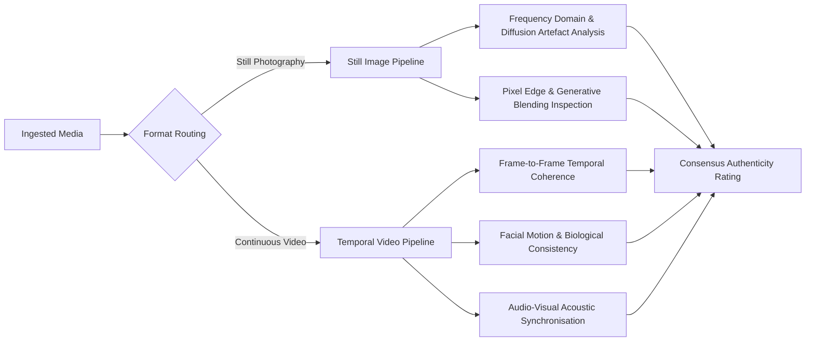

Silicon Trust™ is the core integrity architecture of Extra Scoop. It provides end-to-end verification for breaking news footage by combining hardware-backed capture, automated synthetic-media analysis, and persistent provenance watermarking.

## The Verification Pipeline

When you submit media to Extra Scoop, Silicon Trust™ executes a multi-stage inspection and sealing process:

---

## 1. Decentralised Synthetic Media & Deepfake Detection Flow

Every image and video upload is routed through an independent, decentralised detection oracle network before appearing on the public wire. The oracle network operates distinct analysis pipelines based on media format:

### Still Photography Inspection Pipeline
* **Frequency Domain & Spectral Analysis:** Evaluates the spatial and frequency distributions across raw pixel matrices to detect characteristic noise patterns left by generative diffusion and GAN models.
* **Pixel Edge & Blending Verification:** Inspects foreground-to-background transition boundaries, compression discontinuities, and artificial blending artefacts.

### Video Stream Inspection Pipeline
* **Temporal Coherence Analysis:** Compares consecutive video frames to identify micro-jitter, warping, and frame-to-frame inconsistencies typical of generative video models.
* **Facial & Biological Consistency:** Validates natural eye movement, blinking intervals, skin texture variation, and lighting reflections across subjects in the scene.
* **Audio-Visual Synchronisation:** Inspects waveform alignment between microphone input and visual vocal tract movements to detect synthetic voice cloning or audio dubbing.

### Automated Quarantine vs Verification Approval

| Oracle Verdict | System Behaviour | Commercial Licensing Impact |
| :--- | :--- | :--- |
| **Authenticity Confirmed (Clear)** | The media receives an elevated Trust Score boost and automatically proceeds to the **Provenance Sealing Pipeline**. | Fully unlocked for newsroom bidding and Smart Escrow acquisition. |
| **Synthetic Manipulation Flagged** | The dispatch is immediately quarantined. A warning badge is affixed to the record, and the creator receives an automated audit notice. | **Permanently blocked** from the commercial dealroom to protect newsrooms against fraud. |

---

## 2. Provenance Sealing Pipeline

Media that clears the synthetic detection oracle passes into the automated sealing pipeline:

* **Neural Watermarking:** An imperceptible watermark is embedded across the luminance channels of the asset. The watermark encodes the unique scoop identifier and creator signature.
* **Forward Error Correction:** The watermark incorporates forward error correction algorithms, ensuring the provenance signature survives social media compression, screen recording, and broadcast re-encoding.
* **C2PA Manifest Injection:** A cryptographically signed Coalition for Content Provenance and Authenticity (C2PA) manifest is injected into the container, certifying camera parameters and capture timestamps.

---

## 3. Provenance Invariance (Raw File Purge)

To guarantee that unwatermarked source material cannot leak or be scraped without authorisation, the platform enforces **Provenance Invariance**:

1. The sealing service verifies that the protected, watermarked asset exists and is intact.
2. The protected asset replaces the raw asset on the distribution wire.
3. The platform permanently purges the unwatermarked source file from primary storage.

Once purged, only the sealed version with embedded provenance is accessible for preview across the mobile app and newsroom terminal.

---

## Provenance Guarantees

| Property | Protection Mechanism | Operational Guarantee |
| :--- | :--- | :--- |
| **Authenticity** | Multi-factor oracle screening | Flags AI-generated or manipulated footage before licensing. |
| **Tamper Resistance** | Error-corrected watermarking | Preserves attribution through video re-compression and cropping. |
| **Chain of Custody** | C2PA signed metadata | Verifies hardware origin and capture timestamp for broadcast legal teams. |
| **Source Safety** | Permanent raw purge | Eliminates unauthorised distribution of unprotected raw media. |
