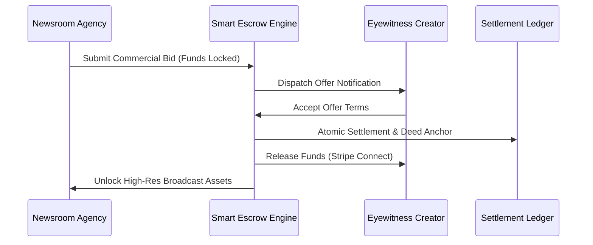

Extra Scoop incorporates an automated Smart Escrow system to manage financial settlement between newsrooms and eyewitnesses. Escrow ensures that newsrooms receive verified broadcast-grade media with full legal provenance, while ensuring creators receive guaranteed payment the moment licensing terms are accepted.

## How Escrow Protects Both Parties

### 1. For Newsrooms
* **Guaranteed Media Delivery:** Bidding funds remain in escrow until the creator accepts the agreement and the platform delivers the certified high-resolution asset.
* **Legal Certainty:** Every settled transaction issues an explicit commercial licence backed by a cryptographic Digital Deed.
* **Automatic Refund:** If an offer expires, is declined by the creator, or is cancelled prior to acceptance, locked escrow funds return immediately to your balance.

### 2. For Eyewitness Creators
* **Guaranteed Payment:** You never release unwatermarked, high-resolution original media on credit. Payment is pre-funded and locked before you accept.
* **Instant Payout:** Accepted funds clear directly into your connected banking account through Stripe Connect.
* **Retained Rights:** If an offer is declined, you retain full ownership and can negotiate with competing news organisations.

## Commercial Bidding Bounds

To maintain institutional compliance and market integrity, all commercial bids within the dealroom adhere to platform bounds:

| Parameter | Bound | Description |
| :--- | :--- | :--- |
| **Minimum Bid** | **£5.00** | The baseline commercial offer for non-exclusive or regional dispatches. |
| **Maximum Single Bid** | **£1,000,000.00** | The single-transaction limit for enterprise exclusive media acquisitions. |
| **Settlement Currency** | **GBP (£)** | Primary clearing currency with automated multi-currency conversion at payout. |

## Settlement Lifecycle

1. **Offer Submission:** The newsroom enters the bid amount in the Concord Dealroom. Funds are verified and held in escrow custody.
2. **Review & Negotiation:** The creator receives a real-time push alert and can accept, counter-offer, or decline through the mobile app.
3. **Atomic Execution:** Upon acceptance, the settlement engine executes simultaneously:
   * Anchors the Digital Deed to the public layer-2 ledger.
   * Unlocks the high-resolution media package and C2PA manifest for the newsroom.
   * Dispatches creator proceeds to Stripe Connect.
