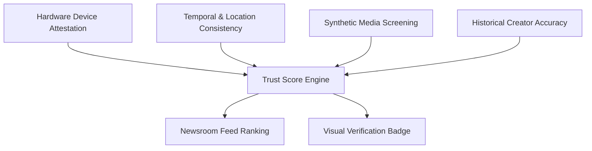

The Trust Score is a dynamic credibility rating assigned to creators and individual media dispatches. It gives newsrooms an immediate measure of authenticity while ensuring high-integrity eyewitness reporting receives priority distribution on the wire.

## Verification Signals

A Trust Score is computed across multiple independent integrity layers:

| Signal Category | Evaluation Method | Protection Provided |
| :--- | :--- | :--- |
| **Hardware Attestation** | Cryptographic device handshake via secure enclaves. | Proves media was captured on genuine mobile hardware and not generated by an emulator or bot. |
| **Temporal & Spatial Integrity** | Cross-verification of sensor timestamps and GPS coordinates via PostGIS spatial indexing. | Ensures capture metadata aligns with the real-world timeline and reported incident location. |
| **Synthetic Media Analysis** | Independent deepfake and generative artefact detection. | Filters out manipulated or AI-generated media before distribution. |
| **Historical Track Record** | Verifiable history of previously licensed, authentic dispatches. | Rewards established eyewitnesses while maintaining rigorous checks for first-time uploaders. |

## Scoring Evaluation

Trust Scores are calculated dynamically upon ingestion and continuously updated as secondary signals (such as PostGIS spatial event corroboration, hardware attestation validity, and historical accuracy) are confirmed. Ratings range from 0 to 100, where dispatches scoring above 80 receive elevated wire priority.

## Feed Ranking and Discovery

Newsroom feeds and consumer discovery tabs use the Trust Score to organise breaking news streams:

* **Latest:** A real-time chronological stream of all newly incoming dispatches.
* **Top Stories:** A weighted intelligence stream combining audience engagement velocity with creator credibility factors.
* **Hot:** A dynamic velocity window highlighting rapidly developing local and global stories.
* **Weighted Interleaving:** The discovery engine cycles across diverse news categories and creator networks in balanced rounds, ensuring local dispatches are not overshadowed by single viral stories.

## Verification Badges in the Terminal

Dispatches that clear all integrity checks display distinct verification indicators in the Newsroom Terminal:

* **High Credibility:** Dispatches clearing full hardware attestation, synthetic-media analysis, and spatial consistency.
* **Under Review:** Newly submitted content undergoing automated processing or awaiting secondary signals.
* **Restricted / Flagged:** Content failing synthetic-media evaluation; automatically suppressed from commercial licensing.
