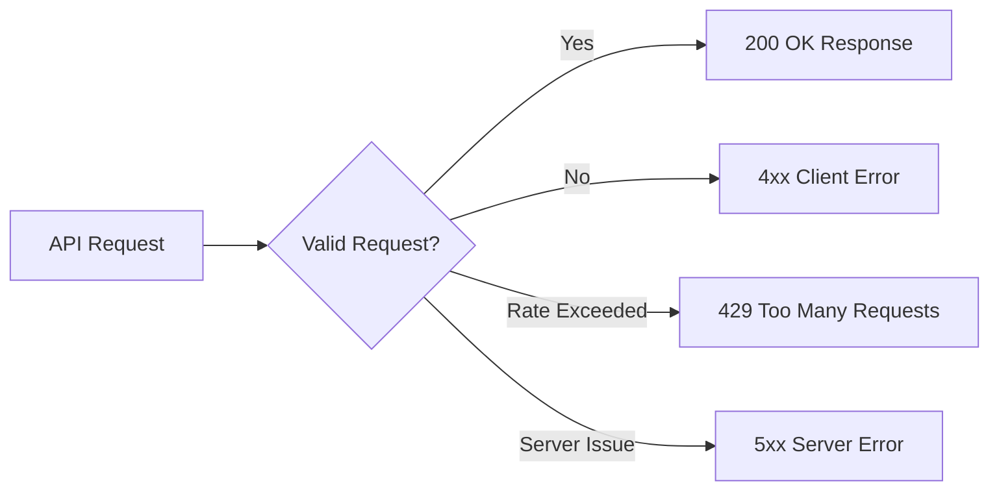

The Extra Scoop API returns standard HTTP status codes and structured JSON error responses to guide client integration and automated exception handling.



## Standard Error Response Format

When an API request fails, the response body contains a structured error payload:

```json
{
  "error": {
    "code": "INVALID_BID_AMOUNT",
    "message": "Bid amount of £4.00 is below the minimum platform bound of £5.00.",
    "status": 400
  }
}
```

## HTTP Status Codes

| Status Code | Code Identifier | Description & Resolution |
| :--- | :--- | :--- |
| **`400 Bad Request`** | `BAD_REQUEST` | The request body or query parameters failed validation. Check parameter types and bounds. |
| **`401 Unauthorized`** | `UNAUTHORIZED` | The `Authorization` header is missing, expired, or malformed. Refresh your token. |
| **`403 Forbidden`** | `FORBIDDEN` | Your organisation lacks permissions for this action (e.g., attempting to access an unlicensed master file). |
| **`404 Not Found`** | `NOT_FOUND` | The requested scoop, offer, or digital deed does not exist. |
| **`409 Conflict`** | `OFFER_ALREADY_PROCESSED` | The targeted offer has already been accepted, expired, or declined by the creator. |
| **`429 Too Many Requests`** | `RATE_LIMIT_EXCEEDED` | Your integration has exceeded its hourly request allocation. Back off and retry. |
| **`500 Internal Error`** | `INTERNAL_SERVER_ERROR` | An unexpected server error occurred. Contact platform support if the issue persists. |

## Rate Limits

To guarantee high availability and low latency across the newsroom wire, requests are rate-limited per API token:

| Tier | Read Requests | Dealroom Actions | Webhook Dispatches |
| :--- | :--- | :--- | :--- |
| **Standard Newsroom** | 1,000 requests / min | 120 bids / min | Unlimited |
| **Enterprise Broadcast Bureau** | 10,000 requests / min | 600 bids / min | Unlimited |

### Rate Limit Headers

Every HTTP response includes standard rate limit headers:

```http
X-RateLimit-Limit: 1000
X-RateLimit-Remaining: 984
X-RateLimit-Reset: 1725055200
```

If you receive a `429 Too Many Requests` response, read the `Retry-After` header and implement exponential backoff before repeating the request.
