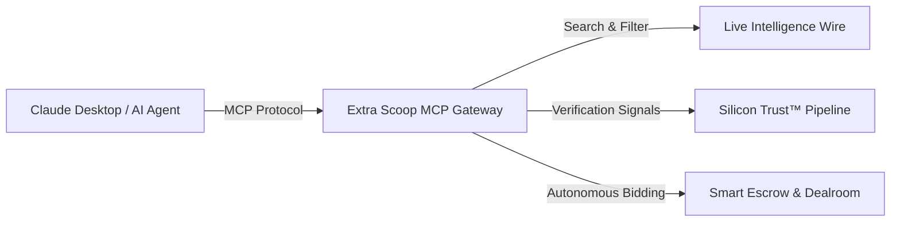

The Extra Scoop Model Context Protocol (MCP) server enables newsrooms to integrate live breaking intelligence, automated scoop discovery, and dealroom bidding directly into AI copilots such as Claude Desktop, Cursor, and enterprise AI agents.



## Connecting Claude Desktop

To connect your local Claude Desktop client to Extra Scoop, add the server definition to your `claude_desktop_config.json`:

```json
{
  "mcpServers": {
    "extra-scoop-b2b": {
      "command": "npx",
      "args": [
        "-y",
        "@modelcontextprotocol/mcp-proxy",
        "https://api.extrascoop.app/functions/v1/mcp-server"
      ],
      "env": {
        "EXTRA_SCOOP_B2B_KEY": "YOUR_AGENCY_API_KEY"
      }
    }
  }
}
```

<Tip>
You can obtain your agency API key in the Newsroom Terminal under **Terminal Settings > Developer > API Tokens**.
</Tip>

---

## Available MCP Tools

Once connected, your AI assistant gains access to native Extra Scoop tools:

### 1. `search_scoops`
Executes natural language and filtered queries against the breaking news database.

* **Parameters:**
  * `query` *(string)*: Keywords or natural language search terms.
  * `category` *(string)*: Filter by beat (`Crisis`, `Politics`, `Tech`, `Crime`, `Business`, `Culture`, `World`).
  * `min_trust_score` *(number)*: Minimum credibility rating (e.g. `80`).
  * `location` *(string)*: City, borough, or geographic area.
  * `timeframe` *(string)*: `24h`, `7d`, or `30d`.

### 2. `get_scoop_details`
Retrieves complete verification intelligence, metadata, and licensing status for a specific dispatch.

* **Parameters:**
  * `scoop_id` *(string)*: Unique identifier of the target scoop.

### 3. `synthesize_briefing`
Generates a concise 2–3 sentence executive newsroom briefing synthesizing key developments across retrieved breaking items.

* **Parameters:**
  * `prompt` *(string)*: Editorial focus or question.
  * `scoop_ids` *(array of strings)*: Target scoops to summarize.

### 4. `make_offer` *(Enterprise Only)*
Enables authorized AI agents to programmatically lock escrow funds and submit commercial licence offers.

* **Parameters:**
  * `scoop_id` *(string)*: The scoop to acquire.
  * `amount` *(number)*: Offer price in GBP (£5.00 to £1,000,000.00).
  * `expiry_minutes` *(number)*: Expiration countdown window (`3`, `5`, `10`, `30`, or `60`).
  * `licence_type` *(string)*: `exclusive` or `syndication`.

---

## Example AI Copilot Prompt

Once configured, you can query Claude directly:

> *"Check Extra Scoop for verified breaking footage of the transport protest in central London over the last 24 hours. Summarize the key angles and let me know if exclusive broadcast rights are available."*

Claude will autonomously invoke `search_scoops`, inspect the C2PA verification signals, and provide an editorial intelligence briefing.
