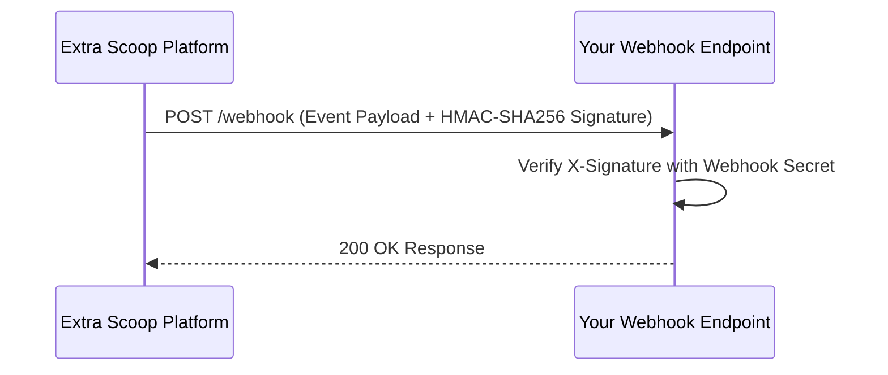

Extra Scoop uses webhooks to notify external newsroom systems when asynchronous events occur on the platform, such as an eyewitness accepting an offer or a digital deed anchoring on-chain.



## Subscribing to Events

You can configure webhook endpoints in the **Developer Settings** panel of the Newsroom Terminal.

### Supported Event Types

| Event Name | Trigger Condition |
| :--- | :--- |
| `escrow.locked` | Triggered when your commercial bid is successfully pre-funded and held in escrow. |
| `offer.countered` | Triggered when an eyewitness proposes revised pricing for a pending bid. |
| `deed.anchored` | Triggered when a creator accepts your offer and the Digital Deed is recorded on-chain. |
| `media.ready` | Triggered when master broadcast files and C2PA manifests are ready for high-speed download. |
| `scoop.verified` | Triggered when a new high-credibility dispatch matching your organisation's watch criteria clears verification. |

## Securing Webhooks with HMAC-SHA256

When Extra Scoop dispatches an event, it includes a cryptographic signature in the `X-Signature` HTTP header. You must verify this signature to ensure the payload originated from Extra Scoop and was not altered in transit.

<Steps>
  <Step title="Extract the Header">
    Read the `X-Signature` header from the incoming request.
  </Step>
  <Step title="Compute the HMAC Hash">
    Calculate an HMAC-SHA256 digest of the raw request payload using your configured webhook secret.
  </Step>
  <Step title="Constant-Time Comparison">
    Compare the computed hash with the header value using a timing-safe string comparison.
  </Step>
</Steps>

## Signature Verification Examples

<CodeGroup>
```typescript Node.js / TypeScript
import crypto from 'crypto';
import { Request, Response } from 'express';

export function handleWebhook(req: Request, res: Response) {
  const signature = req.headers['x-signature'] as string;
  const secret = process.env.EXTRA_SCOOP_WEBHOOK_SECRET!;
  
  const expectedSignature = crypto
    .createHmac('sha256', secret)
    .update(JSON.stringify(req.body))
    .digest('hex');

  const isValid = crypto.timingSafeEqual(
    Buffer.from(signature || '', 'hex'),
    Buffer.from(expectedSignature, 'hex')
  );

  if (!isValid) {
    return res.status(401).send('Invalid signature');
  }

  const event = req.body;
  console.log(`Received verified event: ${event.event_type}`);
  res.status(200).json({ received: true });
}
```

```python Python (FastAPI / Flask)
import hmac
import hashlib
import os
from flask import Flask, request, jsonify

app = Flask(__name__)
WEBHOOK_SECRET = os.environ.get('EXTRA_SCOOP_WEBHOOK_SECRET', '').encode('utf-8')

@app.route('/webhooks/extrascoop', methods=['POST'])
def receive_webhook():
    signature = request.headers.get('X-Signature', '')
    raw_payload = request.get_data()

    computed_sig = hmac.new(WEBHOOK_SECRET, raw_payload, hashlib.sha256).hexdigest()

    if not hmac.compare_digest(signature, computed_sig):
        return jsonify({"error": "Unauthorized: Signature mismatch"}), 401

    data = request.json
    print(f"Verified event received: {data.get('event_type')}")
    return jsonify({"received": True}), 200
```
</CodeGroup>
