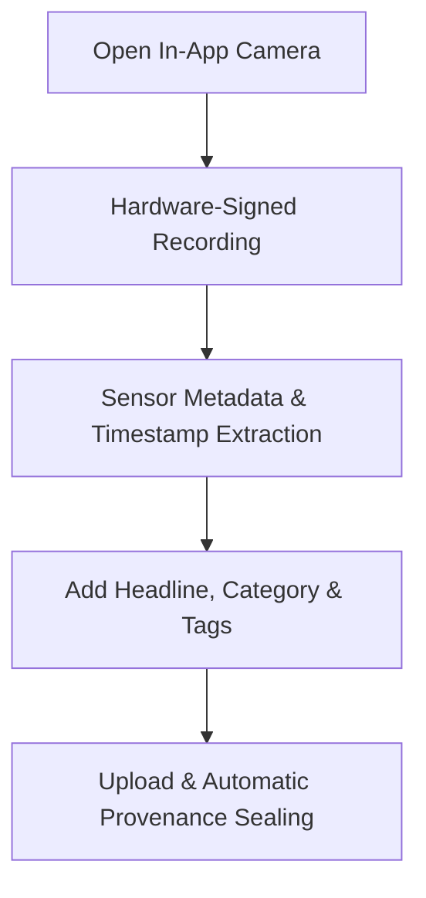

Extra Scoop uses an in-app capture system that establishes an unbroken chain of custody from the moment your camera sensor records light.

## How to Record a Scoop

<Steps>
  <Step title="Open the Capture Interface">
    Tap the **Plus (+)** button in the bottom navigation bar to launch the in-app camera.
  </Step>
  <Step title="Record Footage or Take Photos">
    * Tap the shutter button once for high-resolution still images.
    * Press and hold (or tap video mode) to record continuous breaking video.
    * The capture engine automatically seals device attestation tokens and GPS coordinates into the raw asset container.
  </Step>
  <Step title="Add Story Context">
    * **Headline:** Enter a concise, factual description of the incident.
    * **Category:** Select the primary topic (e.g., Crisis, Politics, Crime, Tech, Culture).
    * **Location Tag:** Confirm the detected location or specify a local landmark.
    * **Hashtags:** Add relevant tags to ensure discoverability by newsroom search filters.
  </Step>
  <Step title="Publish to the Wire">
    Tap **Publish Scoop**. Your media immediately enters the Silicon Trust™ verification pipeline for automated synthetic-media analysis and provenance watermarking.
  </Step>
</Steps>

## Offline Mode and Synchronisation

If you are reporting from an area with weak or disrupted mobile connectivity, Extra Scoop operates in **Offline Mode**:

1. Captured footage is encrypted and queued locally on your device.
2. An offline banner indicates pending dispatches in your queue.
3. Once network connectivity is restored, the application securely uploads the queue in the background without losing original capture timestamps or location data.

## Privacy and Identity Controls

When submitting content, you can control how your identity appears on the public wire:

| Identity Mode | Visibility on Wire | Legal Title on Deed |
| :--- | :--- | :--- |
| **Verified Name** | Your full name and verified badge are public. | Registered directly in your name. |
| **Pseudonymous / Blind ID** | A masked cryptographic session ID is displayed. | Maintained in secure escrow identity storage, protecting source confidentiality. |

To understand how newsrooms bid on your published footage, proceed to [Dealroom & Bidding](/eyewitness/dealroom-bidding).
