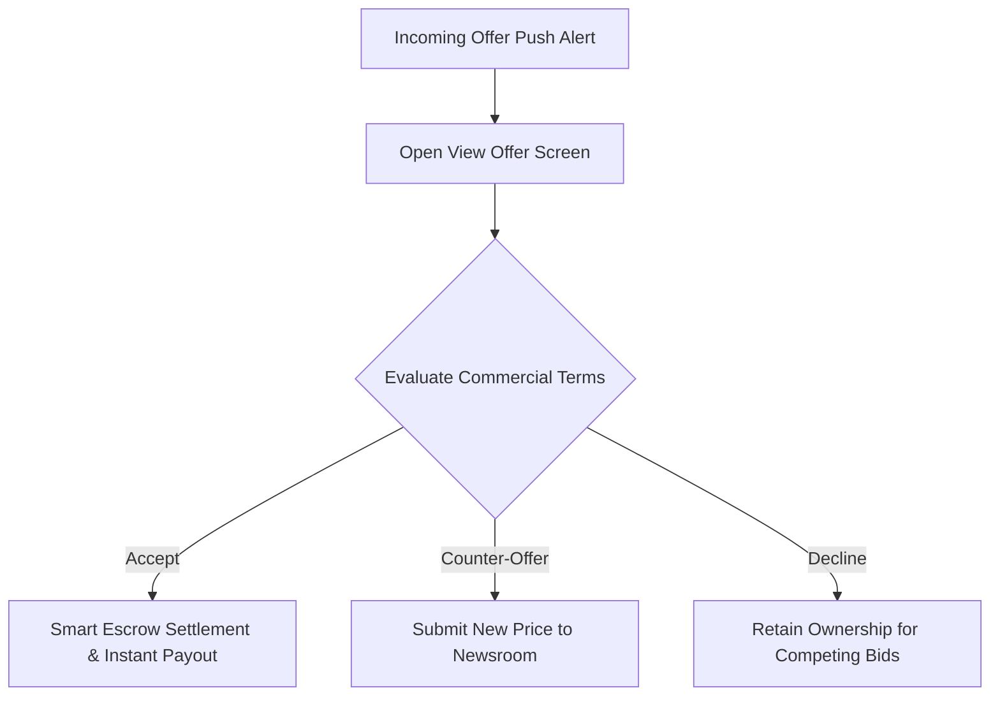

When a newsroom discovers your scoop on the wire, editors can place commercial bids to acquire broadcast rights. You manage and negotiate all incoming proposals within the **Dealroom**.

## Receiving an Offer

When an enterprise agency submits a bid:
1. You receive a high-priority push notification and in-app alert.
2. Open the notification to navigate directly to the **View Offer** dashboard for that specific scoop.
3. The dashboard details the bidding organisation, offer amount in GBP (£), licence type, and the live **expiration countdown timer** (configured by the newsroom between 3 minutes and 1 hour).

## Commercial Bidding Bounds

All commercial offers and counter-proposals operate within strict platform limits:

| Parameter | Platform Bound | Description |
| :--- | :--- | :--- |
| **Minimum Offer** | **£5.00** | The baseline commercial offer for regional or non-exclusive dispatches. |
| **Maximum Single Offer** | **£1,000,000.00** | The single-transaction limit for enterprise exclusive acquisitions. |
| **Timer Windows** | **3m, 5m, 10m, 30m, 1h** | Standard response windows selected by the bidding newsroom. |

## Evaluating Licence Types

| Licence Type | Scope of Rights | Creator Implication |
| :--- | :--- | :--- |
| **Exclusive Commercial Licence** | The purchasing organisation gains sole broadcast and publishing rights. | You cannot license this specific asset to competing newsrooms. |
| **Non-Exclusive Syndication** | The buyer receives non-exclusive editorial usage rights. | You retain the right to license the footage to additional outlets simultaneously. |

## Responding to an Offer

You have three options for every incoming offer before the countdown timer expires:

### 1. Accept the Offer
* Tap **Accept Offer**.
* The platform prompts for your biometric or PIN confirmation.
* Smart Escrow instantly completes settlement:
  * The locked funds transfer to your connected Stripe account.
  * A Digital Deed is anchored on the Base layer-2 blockchain.
  * High-resolution broadcast media unlocks for the newsroom.

### 2. Submit a Counter-Offer
* Tap **Counter Offer** and enter your proposed price (between £5.00 and £1,000,000.00).
* The newsroom editor receives an instant update in their terminal desk with your proposed terms.

### 3. Decline the Offer
* Tap **Decline**. The locked escrow funds return immediately to the newsroom, and your scoop remains available on the open marketplace for other buyers.

Next, learn how to manage your banking details and withdraw earnings in [Payouts & Stripe Connect](/eyewitness/payouts-stripe).
