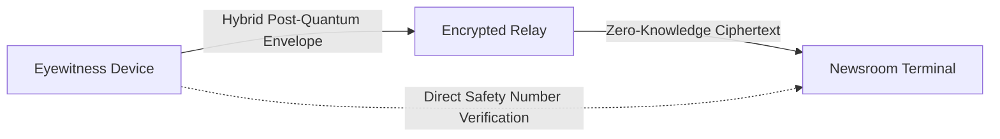

The Ephemeral Messenger is a zero-knowledge, end-to-end encrypted (E2EE) chat environment designed for secure negotiations between eyewitnesses on the ground and newsroom editors.

## Cryptographic Security Layers

To defend against both contemporary surveillance and future quantum computing threats, every message is encapsulated using a hybrid cryptographic framework:

| Security Layer | Standard Utilised | Purpose |
| :--- | :--- | :--- |
| **Post-Quantum Key Exchange** | ML-KEM 768 (Kyber) | Protects session keys against future quantum cryptanalysis ("harvest now, decrypt later"). |
| **Asymmetric Key Exchange** | RSA-OAEP 2048 | Provides robust classical public-key cryptography. |
| **Payload Encryption** | AES-GCM 256 | High-speed symmetric encryption for message content and media attachments. |
| **Hardware-Backed Signatures** | ECDSA P-256 | Leverages the device's hardware Secure Enclave to mathematically guarantee message origin. |

## Ephemeral Privacy & RAM-Only Lifecycle

The messaging architecture enforces strict confidentiality controls:

* **Zero-Persistence Relay:** Messages are routed through isolated encrypted relays. The server retains no plaintext copies, decryption keys, or unencrypted metadata.
* **RAM-Only Session Memory:** Active chat threads exist exclusively in volatile device memory and are never written to permanent disk storage.
* **Deterministic Noise Wipe:** When a chat session reaches its operational timeout or when you sign out, the app overwrites cryptographic memory buffers with cryptographically secure random noise, rendering forensic memory extraction impossible.
* **Safety Numbers & Fingerprints:** Both parties can visually compare a cryptographic safety number to verify that no intermediary has intercepted or modified the communication channel.

## Initiating a Secure Session

1. Open any scoop in the dealroom and tap **Message Newsroom** (or accept an incoming message request from an editor).
2. The client automatically performs a key exchange and establishes the post-quantum encrypted channel.
3. Verify the visual **Safety Number** displayed at the top of the chat window with your counterpart.
4. Conduct price negotiation, clarify contextual details, or share additional perspective securely.
