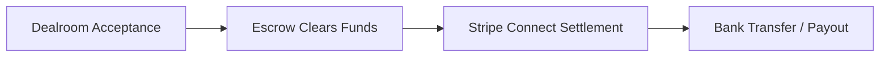

Extra Scoop integrates with Stripe Connect to deliver secure, automated payouts directly to your local bank account whenever a licensing agreement is completed.

## Setting Up Your Payout Account

<Steps>
  <Step title="Navigate to Get Paid">
    Tap your **Profile** tab in the mobile app and select **Get Paid & Earnings**.
  </Step>
  <Step title="Complete Stripe Onboarding">
    Tap **Connect Bank Account**. You will be securely redirected to the Stripe Express onboarding portal to:
    * Enter your legal name and contact details.
    * Provide your bank account details (Sort Code and Account Number for UK accounts, or IBAN/Routing number for international accounts).
    * Complete standard identity verification required by financial regulators.
  </Step>
  <Step title="Verification Confirmation">
    Upon completing the form, you are returned to Extra Scoop. Your profile status updates to **Verified for Payouts**.
  </Step>
</Steps>

## Tracking Balances and Payouts

The **Get Paid** dashboard provides real-time financial tracking:

* **Available Balance:** Funds from settled scoops ready for withdrawal or automatic transfer.
* **Pending Escrow:** Value of active offers currently accepted and undergoing final settlement.
* **Lifetime Earnings:** Historical cumulative total of all media sales and syndication royalties.
* **Transaction History:** Detailed ledger breakdown of each sale, including scoop title, buyer organisation, licence type, and net payout.

## Security and Payout Protection

To protect your earnings against unauthorized withdrawals or account compromise:

* **Biometric Authentication:** Changing bank details or initiating manual transfers requires Face ID / fingerprint verification or your 6-digit Security PIN.
* **Automated Transfers:** Payouts clear automatically according to your regional banking schedule (typically within 1 to 2 business days, or instantly where supported).
* **Account Disconnection:** You can disconnect or rotate your linked payout account at any time through the **Payout Settings** menu.
