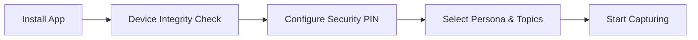

The Extra Scoop mobile app enables you to record breaking news footage, certify its provenance, license it to global news organisations, and get paid directly.

## Step 1: Install and Launch

1. Download Extra Scoop from the Apple App Store or Google Play Store.
2. Launch the application and select **Get Started**.
3. Complete the initial registration using your email address or biometric sign-in.

## Step 2: Grant Permissions

To certify that your footage is genuine and location-accurate, the app requires key device permissions:

* **Camera & Microphone:** Required for in-app video recording and forensic timestamping.
* **Location Services:** Required to embed verifiable geographic coordinates into your dispatch metadata.
* **Push Notifications:** Required to receive instant alerts when newsrooms bid on your scoops.

## Step 3: Configure Security & Identity

During initial setup, you establish your security baseline:

1. **Security PIN:** Set a 6-digit PIN used to authorize sensitive actions, such as bank account changes and cryptographic key rotations.
2. **Biometric Unlock:** Enable Face ID, Touch ID, or fingerprint authentication for fast, secure access.
3. **Whistleblower Privacy:** Choose whether your public profile displays your verified display name or a pseudonymous Blind ID for anonymous reporting.

## Step 4: Choose Your Reporting Persona

The app adapts its feed and alert prioritisation based on your reporting interests:

| Persona | Primary Focus |
| :--- | :--- |
| **Catalyst** | Real-time breaking developments and live incident capture. |
| **Investigator** | In-depth verification, forensic documentation, and investigative leads. |
| **Vigilante** | Hyperlocal community alerts, public safety, and borough-level dispatches. |
| **Speedster** | First-on-the-scene raw reporting with instant upload prioritisation. |
| **Default** | Balanced coverage spanning regional, national, and international headlines. |

You can update your persona and notification preferences at any time in **Settings > Preferences**.

Next, learn how to [Capture Verified Footage](/eyewitness/capturing-footage).
