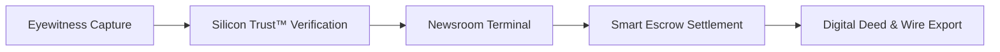

Extra Scoop is an institutional media network that bridges eyewitnesses on the ground with broadcast newsrooms. The platform combines hardware-backed capture, automated authenticity verification, and cryptographic licensing to establish an unbroken chain of custody for breaking news.

You can use Extra Scoop across two primary interfaces:
* **The Eyewitness Mobile App:** A mobile application for capturing verified footage, preserving camera provenance, negotiating commercial licences, and receiving instant payouts.
* **The Newsroom Terminal:** A multi-stream desktop intelligence desk for wire editors and journalists to monitor incoming dispatches, inspect verification signals, acquire exclusive licences, and export packages to broadcast systems.

## How Extra Scoop Works

The platform operates across four continuous stages:

1. **Verified Capture:** You capture breaking media directly through the mobile application. The camera system records hardware provenance and cryptographic timestamps at the moment of recording.
2. **Authenticity Inspection:** Every upload undergoes automated integrity analysis, including synthetic-media detection and metadata integrity checks, before reaching the newsroom wire.
3. **Institutional Dealroom:** Newsrooms monitor verified intelligence streams, evaluate verification reports, and submit commercial bids directly to the creator.
4. **Settlement and Delivery:** When you accept an offer, funds settle through escrow, an immutable Digital Deed is anchored to a public ledger, and broadcast-ready assets unlock for newsroom export.

## Core Capabilities

| Capability | Eyewitness Benefit | Newsroom Benefit |
| :--- | :--- | :--- |
| **Silicon Trust™** | Protects your original work against unauthorized copying with invisible provenance watermarking. | Guarantees media authenticity with independent deepfake and synthetic-media screening. |
| **Digital Deeds** | Establishes legal copyright ownership and transparent commercial terms. | Provides clear indemnity and a verifiable chain of custody for editorial broadcast. |
| **Smart Escrow** | Ensures guaranteed payment prior to the release of high-resolution source media. | Secures bidding funds in escrow until licensing terms are formally accepted. |
| **Ephemeral Chat** | Protects source confidentiality with post-quantum end-to-end encryption. | Enables direct, secure price negotiation with eyewitnesses on the scene. |

---

## Architectural Transparency & Adversarial Design

Extra Scoop operates on the principle of **verifiable cryptographic outputs rather than public algorithmic heuristics**.

<Note>
**Adversarial Integrity Policy**  
To protect the verification network against automated spoofing, synthetic evasion attacks, and coordinated rating manipulation, Extra Scoop does not publish static mathematical weighting formulas, internal scoring coefficients, or proprietary oracle consensus thresholds. The platform provides verifiable cryptographic assertions, C2PA signed manifests, and public blockchain receipts that can be independently audited by newsrooms and legal compliance teams.
</Note>

To get started, explore the [Platform Glossary](/introduction/glossary) or review the [Silicon Trust™ Architecture](/concepts/silicon-trust).
