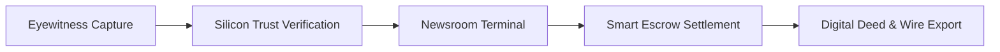

Extra Scoop connects eyewitnesses on the ground directly with newsrooms, publishers, and media agencies. The platform provides hardware-backed capture, automated synthetic media screening, and cryptographic licensing to establish an unbroken chain of custody for breaking eyewitness footage.

## System Architecture

The platform connects two primary environments:

* **Eyewitness Mobile App ([iOS App Store](https://apps.apple.com/gb/app/extra-scoop/id6760804538)):** A mobile client for capturing authenticated footage, preserving hardware device attestation tokens, negotiating commercial licences, and receiving payouts via Stripe Connect.
* **Newsroom Terminal ([terminal.extrascoop.app](https://terminal.extrascoop.app)):** A multi-stream desktop workspace for wire editors and journalists to monitor incoming breaking dispatches, inspect verification reports, place commercial bids, and export broadcast-ready packages to newsroom CMS systems.

## Operational Lifecycle

Media moves through four distinct operational phases:

1. **Hardware-Attested Capture:** Media is recorded directly within the mobile application. The camera engine captures raw sensor frames, cryptographic device tokens from the Apple Secure Enclave, and tamper-resistant GPS metadata.
2. **Multi-Signal Verification:** Uploads undergo automated multi-stage analysis, including frequency-domain synthetic media screening, temporal consistency analysis, and C2PA provenance manifest signing.
3. **Newsroom Dealroom & Negotiation:** Newsrooms monitor verified intelligence streams, inspect authenticity dossiers, and submit commercial bids directly to the contributor with configurable expiration timers (3m, 5m, 10m, 30m, 1h).
4. **Escrow Settlement & Master Delivery:** When a bid is accepted, funds settle via smart escrow, an immutable Digital Deed is anchored to the Base layer-2 blockchain, and the high-resolution master file unlocks for broadcast export.

## Core Subsystems

| Subsystem | Functional Role | Technical Mechanism |
| :--- | :--- | :--- |
| **Silicon Trust™** | Provenance sealing & deepfake screening | Spectral frequency analysis, video temporal coherence checks, neural watermarking, and C2PA container injection. |
| **Digital Deeds** | Ownership & commercial licensing | Base layer-2 smart contracts (`ContentDeed.sol`) storing Merkle provenance roots and IPFS manifest URIs. |
| **Smart Escrow** | Financial settlement | Automated programmatic custody (£5.00 min to £1,000,000.00 max) with instant payout upon agreement. |
| **Ephemeral Messenger** | Confidential source negotiation | Hybrid post-quantum key encapsulation (ML-KEM 768 / RSA-OAEP 2048) with 15-minute RAM-only session lifetimes. |
| **Newsroom Terminal** | Wire monitoring & dispatch triage | Real-time multi-column streams, acoustic alert monitors, and OmniCommand query compilation with vector caching. |
| **Model Context Protocol** | AI newsroom copilot integration | Native MCP server providing programmatic endpoints for Claude Desktop, Cursor, and newsroom automation agents. |

To get started, explore the [Platform Glossary](/introduction/glossary) or review the [Silicon Trust™ Architecture](/concepts/silicon-trust).
