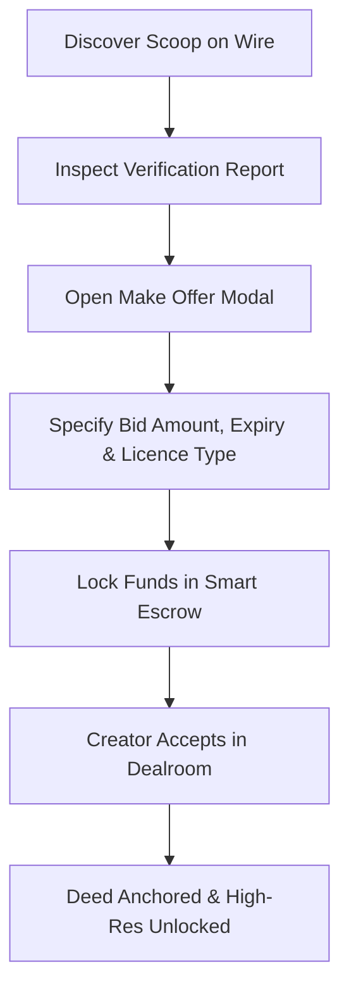

The Concord Dealroom is the institutional transaction desk within the Newsroom Terminal. It enables newsrooms to inspect verification reports, make commercial offers, negotiate terms with creators, and secure exclusive broadcast rights.

## Reviewing Verification Intelligence

Before placing a commercial bid, click on any scoop card to open the **Verification Dossier**:

* **Authenticity Verdict:** Independent oracle detection confirming absence of deepfake or synthetic manipulation.
* **C2PA Manifest Details:** Hardware device credentials, capture timestamps, and camera sensor parameters.
* **Geographic Alignment:** Sensor GPS coordinates mapped against reported incident locations.

## Placing an Offer

<Steps>
  <Step title="Open Make Offer Modal">
    Click **Make Offer / Acquire Licence** on the scoop detail page.
  </Step>
  <Step title="Set Commercial Terms & Timers">
    * **Bid Amount:** Enter your proposed price in GBP (£). Bids must fall within platform bounds (**£5.00** minimum up to **£1,000,000.00** maximum).
    * **Offer Expiry Time:** Select an automated countdown window (**3 minutes**, **5 minutes**, **10 minutes**, **30 minutes**, or **1 hour**). If the creator does not respond within this window, the offer automatically expires and locked escrow funds return immediately to your balance.
    * **Licence Scope:** Select *Exclusive Commercial Licence* (sole rights) or *Syndication Licence* (shared editorial usage).
  </Step>
  <Step title="Lock Funds in Escrow">
    Click **Confirm & Lock in Escrow**. The required funds are verified from your agency deposit and held in secure escrow.
  </Step>
</Steps>

## Managing Active Negotiations

The **Concord Dealroom** interface categorises all ongoing agency transactions:

| Section | Description | Available Actions |
| :--- | :--- | :--- |
| **Active Bids (Under Offer)** | Offers submitted to creators with live countdown timers. | Revoke offer (returns funds immediately) or adjust bid amount. |
| **Counter-Proposals** | Bids where the eyewitness has proposed a modified price. | Accept creator terms to settle immediately, or submit a revised counter-offer. |
| **Purchased Licences** | Fully settled media assets. | Access high-resolution video streams, download C2PA manifests, or export to broadcast wire. |

## Settlement and Legal Protection

The instant an eyewitness accepts your offer:
1. Smart Escrow transfers funds to the creator.
2. The transaction is notarised with an on-chain Digital Deed on Base layer-2.
3. Your organisation receives immediate commercial indemnity and the asset is permanently moved to your [Deed Vault](/terminal/deed-vault).
