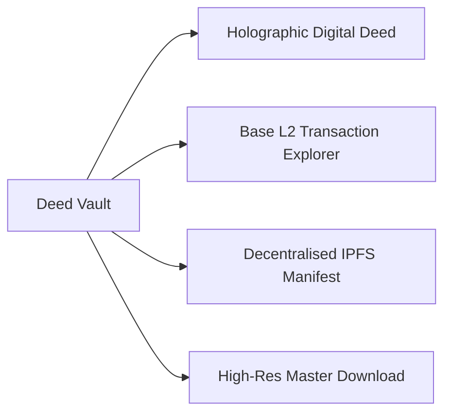

The Deed Vault is your agency's permanent legal and forensic archive. It stores all acquired Digital Deeds, C2PA provenance receipts, and high-resolution master media packages in a single auditable interface.



## Digital Deed Inspection

Clicking on any purchased licence in the Deed Vault opens the **Interactive Digital Deed**:

* **Licence Certificate:** Formal legal instrument detailing the granting organisation, licensee bureau, purchase price, and commercial rights granted.
* **Forensic Anchor (Merkle Root):** The SHA-256 cryptographic hash uniquely binding the scoop content to the purchase agreement.
* **Public Ledger Receipt:** A direct link to the transaction on the Base layer-2 blockchain confirming on-chain anchoring.
* **IPFS Decentralised Record:** The permanent content identifier (CID) hosting the tamper-proof JSON manifest.

## Accessing Master Media Files

Once a deed settles, watermark restrictions on the master asset are lifted for your organisation:

1. **High-Resolution Master Stream:** Stream or download uncompressed 4K / HD video and raw still photography.
2. **C2PA Manifest Download:** Export the standalone C2PA cryptographic signature file for attachment to broadcast packages.
3. **Legal Compliance Package:** Download a consolidated PDF receipt containing complete chain of custody and indemnity clauses for your legal department.

## Auditing and Chain of Custody

The Deed Vault allows editorial compliance teams to independently verify the authenticity of any historical purchase:

```bash
# Verify the cryptographic anchor independently
echo -n "SCOOP_ID:C2PA_ROOT:AGENCY_ID" | sha256sum
```

Comparing this hash against the on-chain `DeedAnchored` event confirms that the media package remains identical to the certified original captured on the ground.

To export your licensed assets into newsroom automation systems, see [Wire Format Exporter](/terminal/wire-exporter).
