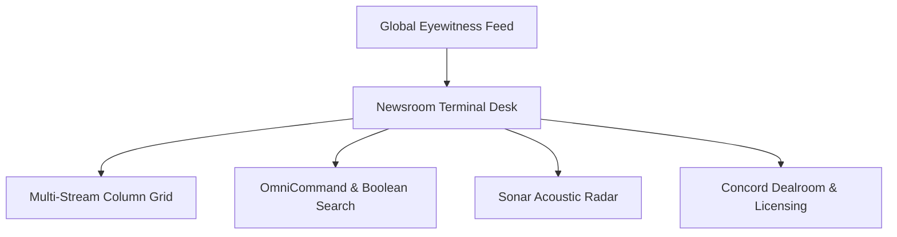

The Newsroom Terminal is a desktop intelligence platform engineered for broadcast newsrooms, wire services, and investigative desks. It provides real-time monitoring of verified breaking dispatches, instant commercial licensing, and direct broadcast export.

## Core Terminal Capabilities

* **Multi-Stream Intelligence Grid:** Create custom, draggable stream columns filtered by region, topic category, or verification status.
* **OmniCommand Search:** Execute rapid natural language queries or advanced Boolean operators (`AND`, `OR`, `NOT`, `trust:>N`, `#hashtags`) to isolate breaking leads.
* **Sonar Acoustic Radar:** Configurable Web Audio synthesised radar pings that alert editors the moment high-priority verified footage hits the wire.
* **Concord Dealroom:** Institutional interface to place commercial bids, negotiate terms in real time, and execute smart escrow transactions.
* **1-Click Broadcast Export:** Package verified stories into industry-standard IPTC NewsML-G2 XML or dispatch automated JSON webhooks into your newsroom CMS.

## Navigation and Workspace Views

You can switch between three primary views in the top navigation bar:

| View Mode | Purpose | Primary Use Case |
| :--- | :--- | :--- |
| **Workspace Columns** | Multi-column real-time stream layout. | Continuous monitoring of multiple beats, regions, and breaking crisis events. |
| **Grid Feed** | Single-window visual grid. | In-depth visual triage and media review of incoming dispatches. |
| **Deed Vault** | Centralized legal repository. | Tracking purchased exclusive licences, on-chain deeds, and indemnity manifests. |

## Access and Security

Access to the Newsroom Terminal is restricted to verified media organisations, news agencies, and certified investigative bureaus. All terminal actions are cryptographically authenticated to maintain an audited record of media acquisitions.

Next, learn how to configure your multi-column streams in [Workspace Columns](/terminal/workspace-columns).
