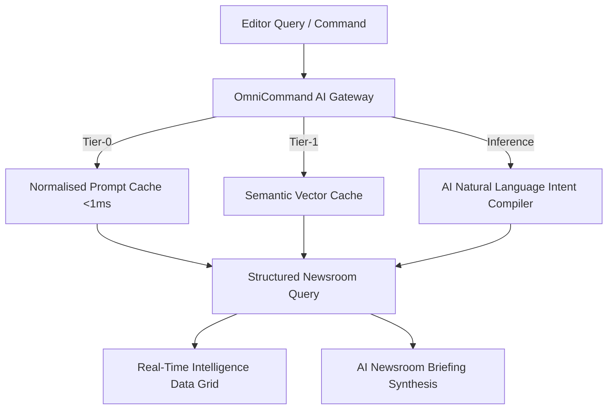
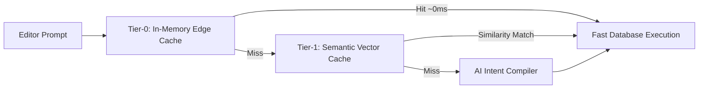

The Newsroom Terminal workspace allows you to assemble tailored monitoring desks by configuring multi-column intelligence feeds and executing rapid AI-powered natural language queries or structured Boolean searches.

## Managing Workspace Columns

You can configure multiple independent columns side-by-side to monitor different beats simultaneously:

<Steps>
  <Step title="Add a New Column">
    Click the **Add Column (+)** button in the workspace toolbar, or drag a filter preset directly onto the canvas.
  </Step>
  <Step title="Configure Column Filters">
    Click the filter icon in the column header to set specific criteria:
    * **Feed Scope:** Select *Latest* (chronological), *Top Stories* (rank-weighted), or *Hot* (velocity).
    * **Category:** Focus on specific beats such as *Crisis*, *Politics*, *Tech*, *Crime*, or *World*.
    * **Geographic Region:** Filter by city, borough, or coordinate radius using PostGIS spatial search.
  </Step>
  <Step title="Reorder and Save Layout">
    Drag columns horizontally to reorder your workspace. The terminal automatically persists your layout locally across sessions.
  </Step>
</Steps>

## OmniCommand AI Search Engine

The **OmniCommand Bar** at the top of the terminal acts as an AI-powered intelligence compiler that translates complex editorial questions into high-speed database queries and synthesized briefings.

### How the AI Reduces Latency

To deliver sub-second search responses across massive media archives, the OmniCommand architecture uses a multi-tier caching and compilation pipeline:

1. **Tier-0 Edge In-Memory Cache (Sub-1ms):** Frequently requested newsroom queries and normalised prompt patterns are resolved instantly at the edge.
2. **Tier-1 Semantic Vector Cache:** Converts incoming queries into vector embeddings and matches semantically identical requests using cosine distance indexing without invoking LLM inference repeatedly.
3. **AI Natural Language Intent Compiler:** For novel prompts, a specialised language model extracts keywords, category beats, credibility requirements, media format preferences (video vs still photography), geographic bounds, and timeframes (e.g. 24h, 7d, 30d).
4. **Deterministic Client Fallback:** If offline or experiencing connection drops, a local heuristic compiler processes keywords instantly without interruption.

### AI Newsroom Briefing Synthesis

When you run a search, the OmniCommand engine can also generate an automated **AI Newsroom Briefing**—a concise 2–3 sentence factual summary synthesising key breaking developments across all retrieved dispatches to accelerate editorial decision-making.

---

## Boolean Query Syntax

In addition to conversational AI prompts, editors can execute precise Boolean queries directly in the OmniCommand Bar:

| Operator | Syntax Example | Behaviour |
| :--- | :--- | :--- |
| **AND** | `parliament AND protest` | Matches dispatches containing both terms. |
| **OR** | `fire OR explosion` | Matches dispatches containing either term. |
| **NOT** | `aviation NOT military` | Excludes dispatches containing the specified term. |
| **Trust Threshold** | `trust:>85` | Restricts results to dispatches with a Trust Score exceeding the specified level. |
| **Hashtags** | `#Westminster` | Filters by indexed community or newsroom hashtags. |

---

## Acoustic Alert System

To ensure editors never miss breaking developments while multitasking across screens, the terminal includes audio alerts:

* **Real-Time Chimes:** Emits a subtle acoustic tone whenever a newly published dispatch matching your column criteria hits the wire.
* **Alert Customisation:** Configure audio tone, alert volume, or mute specific categories in **Terminal Settings > Audio**.
