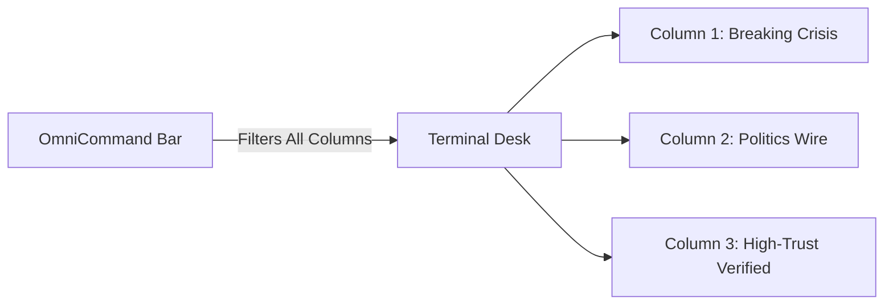

The Newsroom Terminal workspace allows you to assemble tailored monitoring desks by configuring multi-column intelligence feeds and running lexical or natural language searches.

## Managing Workspace Columns

You can configure multiple independent columns side-by-side to monitor different beats simultaneously:

<Steps>
  <Step title="Add a New Column">
    Click the **Add Column (+)** button in the workspace toolbar, or drag a filter preset directly onto the canvas.
  </Step>
  <Step title="Configure Column Filters">
    Click the filter icon in the column header to set specific criteria:
    * **Feed Scope:** Select *Latest* (chronological), *Top Stories* (rank-weighted), or *Hot* (velocity).
    * **Category:** Focus on specific beats such as *Crisis*, *Politics*, *Tech*, *Crime*, or *World*.
    * **Geographic Region:** Filter by city, borough, or country.
  </Step>
  <Step title="Reorder and Save Layout">
    Drag columns horizontally to reorder your workspace. The terminal automatically persists your layout locally across sessions.
  </Step>
</Steps>

## OmniCommand & Boolean Search

The **OmniCommand Bar** located at the top of the terminal accepts both natural language queries and structured Boolean expressions.

### Boolean Query Syntax

You can refine your searches using standard operators:

| Operator | Syntax Example | Behaviour |
| :--- | :--- | :--- |
| **AND** | `parliament AND protest` | Matches dispatches containing both terms. |
| **OR** | `fire OR explosion` | Matches dispatches containing either term. |
| **NOT** | `aviation NOT military` | Excludes dispatches containing the specified term. |
| **Trust Threshold** | `trust:>85` | Filters for dispatches with a Trust Score exceeding the specified level. |
| **Hashtags** | `#Westminster` | Restricts results to specific indexed hashtags. |

### Natural Language Search

You can also enter plain-language search instructions, such as *"Show verified footage of protests in central London from today"*. The terminal's newsroom compiler automatically extracts core keywords, matches relevant geographic bounds, and applies credibility filters.

## Sonar Acoustic Radar

To ensure editors never miss breaking developments while working across multiple screens, the terminal incorporates an acoustic radar:

* **Radar Pings:** Generates a subtle, synthesised acoustic ping whenever a new high-priority dispatch matching your column criteria lands on the wire.
* **Volume & Threshold Controls:** Configure audio alert sensitivity or mute specific beats in **Terminal Preferences > Audio**.
